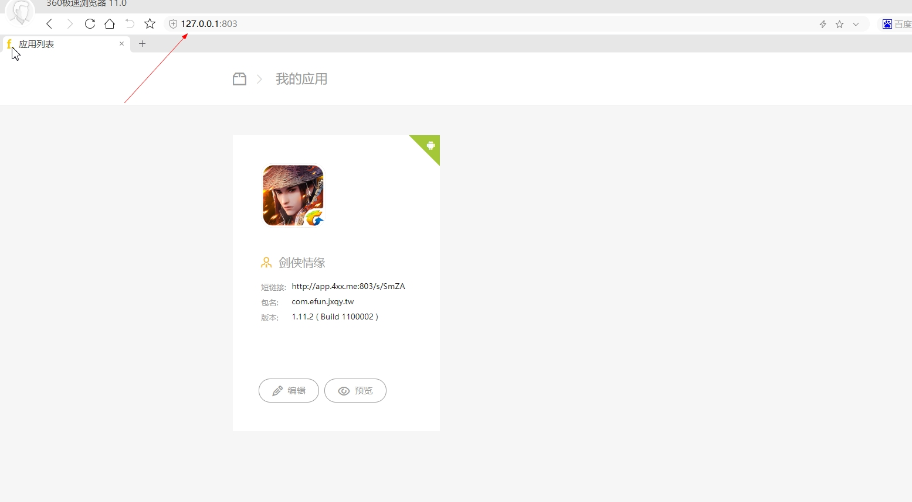
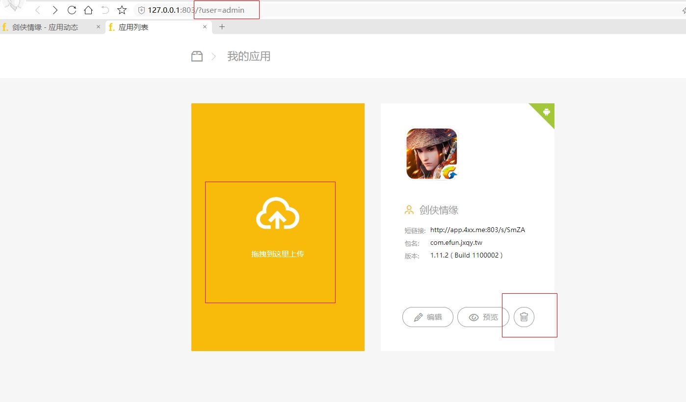
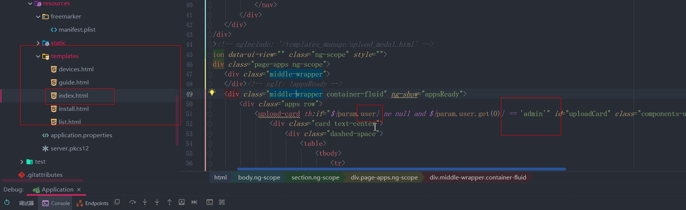
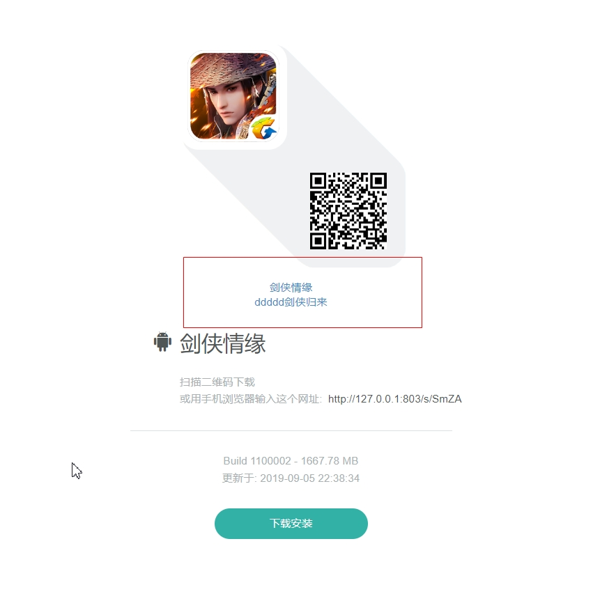
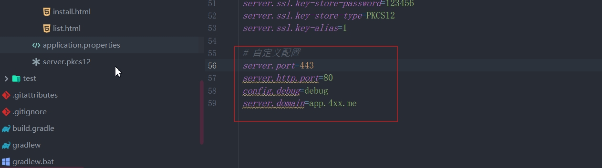

# app应用分发平台

#### 本项目是 [https://github.com/yizhaorong/intranet_app_manager](https://github.com/yizhaorong/intranet_app_manager) 项目的修改版，详细介绍、说明等请去原项目查看

### 本项目修改内容：
1. 添加简单权限控制。
    - 不带指定参数访问时，不能上传、删除应用





    - 可自定义参数内容，修改文件`index.html`，默认参数`user=admin`


2. 删除应用详情页的 删除 操作

3. 应用下载页样式调整，并展示 描述字段 内容



4. ios的包需要https，可以将普通的https密钥`.key`文件用命令转换成所需的`.pkcs12`文件
```
openssl pkcs12 -export -in server.crt -inkey server.key -out server.pkcs12
```

5. 导入数据库、修改`application.properties`配置文件




